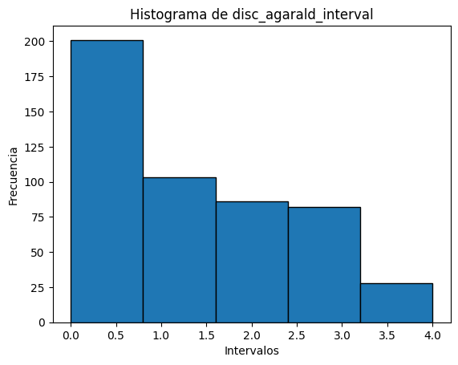

---
output:
  pdf_document: default
  html_document: default
toc: True
---

\pagebreak

# Punto 1

## Análisis de Severidad de Reclamaciones en Seguros de Motocicletas

### Introducción

El presente análisis tiene como objetivo profundizar en la clasificación tarifaria mediante la metodología de los Modelos Lineales Generalizados (GLM), utilizando datos históricos proporcionados por la aseguradora sueca Wasa. La base de datos cubre el periodo de 1994-1998 y contiene información detallada sobre pólizas de seguros y reclamaciones de motocicletas, en un total de 64,548 observaciones con 9 variables clave:

**Edad del dueño (agarald):** Edad del propietario del vehículo, entre 0 y 99 años.

**Sexo del dueño (kon):** Género del propietario, representado por los niveles M (Masculino) y K (Femenino).

**Zona geográfica (zon):** Clasificación geográfica que divide las parroquias suecas en 7 zonas.

**Clase de motocicleta (mcklass):** Clasificación según la relación entre la potencia del motor y el peso del vehículo, en 7 clases.

**Edad del vehículo (fordald):** Edad del vehículo asegurado, entre 0 y 99 años.

**Clase de bonificación (bonuskl):** Nivel de bonificación de la póliza, de 1 a 7, basado en la cantidad de años sin reclamaciones.

**Duración de la póliza (duration):** Duración de la póliza, expresada en años.

**Número de reclamaciones (antskad):** Cantidad de reclamaciones asociadas a cada póliza.

**Costo de la reclamación (skadkost):** Monto reclamado en cada siniestro.

Para este ejercicio, el enfoque principal es excluir las reclamaciones nulas, es decir, aquellas en las que no hubo desembolso por parte de la aseguradora. Estas reclamaciones nulas se identifican en la columna skadkost, donde el valor es igual a 0. 

### Preparación de los Datos

Primero, se filtraron las reclamaciones con severidad no nula (skadkost) y se seleccionó una submuestra aleatoria de 500 registros

```{r}
# Cargar la base de datos
library(insuranceData)
data("dataOhlsson")

# Filtrar las reclamaciones con severidad no nula
data_filtrada <- subset(dataOhlsson, skadkost > 0)

# Seleccionar aleatoriamente una submuestra de 500 registros
set.seed(1042067088)  # Para hacer la muestra reproducible
submuestra <- data_filtrada[sample(nrow(data_filtrada), 500), ]

# Cantidad de registros reducido
nrow(data_filtrada) 

# Verificar la estructura de la submuestra
str(submuestra)


```

Después de aplicar este filtro, se obtuvo una base de datos con 670 registros que contienen reclamaciones con costos asociados.

Posteriormente, se seleccionó aleatoriamente una submuestra de 500 registros con severidad no nula para realizar el análisis, se utilizo como semilla la cédula de Juan Pablo Grajales (1042067088). 


# Punto 2

Construya un modelo GLM para la prima con al menos 2 factores de calificacion. Ud se dara cuenta que la base solo dispone de 5 variables explicativas.

**Determine** las relatividades de cada celda tarifaria y analice si la agrupacion implicada por el modelo debe ser modificada o no. 

**Reporte** los resultados en forma de tabla (Consulte el libro, tablas 1.2 pag 5
y 2.7 pag 35).


## Modelo GLM

Para construir nuestro modelo, los factores que vamos a utilizar seran los correspondientes a las variables **mcklass (tipo de motocicleta)** y **kon (sexo del conductor** y la variable respuesta seria **skadkost (costo de la reclamacion)**, por lo tanto nuestro modelo quedaria de la siguiente forma:


$$g_1(\mu) = \eta_1 = \beta_0 + \sum_{i=1}^{k-1} \beta_i D_i$$

- $g_1(\mu)$ es la función de enlace para el parámetro $\mu$

- $\eta_1$ es el predictor lineal asociado con  $\mu$

- $\beta_0$ es el intercepto.


- $\beta_i$ son los coeficientes asociados con las **k-1** variables ficticias (dummy) que representan los niveles de la variable categórica $X$. En general, se omite un nivel de la variable categórica como el **nivel de referencia**.


```{r}
glm_punt2 = glm(skadkost ~ factor(mcklass) + kon, family =Gamma(link = "log"), data = data_filtrada)
```

## Deviance del modelo

La deviance es una medida de la bondad de ajuste de un modelo estadístico. Representa el doble de la diferencia entre el logaritmo de la verosimilitud del modelo ajustado y el modelo saturado (uno que tiene el ajuste perfecto a los datos).

```{r}

# Calcular la desviance del modelo ajustado
desviance_glm <- deviance(glm_punt2)

# Crear un data frame para mostrar la deviancia
resultado_deviance <- data.frame(
  Modelo = "Modelo Ajustado",
  Deviance = desviance_glm
)

# Mostrar la deviancia con kable
library(knitr)
kable(resultado_deviance, caption = "Desviancia del Modelo Ajustado")


```
La deviance obtenida es 1356.268, lo que representa la discrepancia entre el modelo ajustado y los datos observados. Para interpretar mejor este resultado, comparamos la deviance del modelo ajustado con la deviance del modelo nulo, es decir, un modelo sin factores explicativos.

```{r}
# Ajustamos el modelo nulo
modelo_nulo <- glm(skadkost ~ 1, family = Gamma(link = "log"), data = data_filtrada)

# Calculamos la deviance del modelo nulo
deviance_nulo <- deviance(modelo_nulo)

# Crear un data frame para mostrar la deviancia del modelo nulo
resultado_deviance_nulo <- data.frame(
  Modelo = "Modelo Nulo",
  Deviance = deviance_nulo
)

# Mostrar la deviancia con kable
library(knitr)
kable(resultado_deviance_nulo, caption = "Desviancia del Modelo Nulo")

```

La deviance del modelo ajustado fue 1356.268, mientras que la deviance del modelo nulo fue 1392.144. Estos valores son fundamentales para evaluar la calidad del modelo, ya que la deviance mide la discrepancia entre el modelo ajustado y los datos observados. En este caso, la comparación entre ambas deviances nos permite observar una reducción significativa al pasar del modelo nulo al modelo ajustado.

El modelo nulo, que no incluye ninguna variable predictora, sirve como punto de referencia y su deviance refleja la cantidad de variabilidad en el costo de la reclamación que no puede ser explicada. En contraste, la deviance del modelo ajustado incorpora las variables predictoras seleccionadas, como las variables **mcklass** y **kon**, lo que reduce la discrepancia entre el modelo y los datos.

La disminución de la deviance al incluir estas variables en el modelo sugiere que estas características tienen un impacto significativo en el costo de la reclamación, mejorando la capacidad del modelo para capturar patrones presentes en los datos. En términos más precisos, la inclusión de las variables **mcklass** y **kon** permite al modelo ajustado explicar una mayor proporción de la variabilidad observada en los costos de las reclamaciones, lo que se traduce en un ajuste más preciso en comparación con el modelo nulo.

Este resultado no solo demuestra que el modelo ajustado ofrece una mejora respecto al modelo nulo, sino que también destaca la importancia de las variables explicativas seleccionadas en la predicción de los costos. Si bien esta mejora es evidente, conviene profundizar en el análisis para evaluar si la reducción en la deviance es estadísticamente significativa y si las variables seleccionadas son las más adecuadas o si pueden ser reemplazadas o complementadas por otras que aporten aún mayor explicatividad.


## LRT test

El Test de Razón de Verosimilitud (Likelihood Ratio Test, LRT) es un método estadístico utilizado para comparar la bondad de ajuste de dos modelos estadísticos, uno de los cuales es un subconjunto del otro (es decir, el modelo restringido es un caso especial del modelo completo). El LRT examina si el modelo más complejo (completo) proporciona un ajuste significativamente mejor a los datos que el modelo más simple (restringido).


```{r}
library(lmtest)

modelo_completo = glm_punt2

#KON

modelo_reducido <- glm(skadkost ~ factor(mcklass), family =Gamma(link = "log"), data = data_filtrada)

# MCKLASS

modelo_reducido2 <- glm(skadkost ~ kon, family =Gamma(link = "log"), data = data_filtrada)


kon = lrtest(modelo_reducido,modelo_completo)

mcklass = lrtest(modelo_reducido2,modelo_completo)
```


```{r}
knitr::kable(data.frame(
  "Factor de clasificacion" = c("Kon", "Mcklass"),
  "fs - fr" = c(kon$`#Df`[2] - kon$`#Df`[1], mcklass$`#Df`[2] - mcklass$`#Df`[1]),
  "fs" = c(kon$`#Df`[2], mcklass$`#Df`[2]),
  "Test statistic" = c(kon$Chisq[2], mcklass$Chisq[2]),
  "Valor-p" = round(c(kon$`Pr(>Chisq)`[2], mcklass$`Pr(>Chisq)`[2]), 5)
), caption = "LRT test excluyendo el factor de clasificacion en cuestion")
```


La variable **kon** parece tener poco efecto sobre eñ monto reclamado en cada siniestro, por otro lado la variable **mcklass** tiene un efecto significativo sobre la variable respuesta.


## Relatividades del modelo

Ahora teniendo el modelo, procederemos a estimar las relatividades asociadas a los factores de calificacion, y posteriormente procederemos a calcular los respectivos intervalos de confianza. El calculo de las relatividades nos sera util para verificar si la agrupacion implicada por el modelo debe ser modificada o no.

Las relatividades $\gamma$ se calculan de la siguiente forma:

$$\gamma_j = exp \{\beta_j \}$$

donde $\beta_j$ son los coeficientes del modelo

```{r}
coeficientes <- coef(glm_punt2)
relatividades <- exp(coeficientes)

# Crear una tabla de relatividades tarifarias
tabla_relatividades <- data.frame(Factor = names(coeficientes),
                                  Coeficiente = coeficientes,
                                  "Estimacion relatividad" = round(relatividades,3))
```


Para calcular los intervalos de confianza para las relatividades se hace de la siguiente forma:


$$\hat{\beta} \overset{d} \approx N(\beta, I^{-1})$$

Un intervalo de confianza para (a, b) del 95% aproximado para $\beta_j$ es:

$$\hat{\beta_j} \pm 1.96 \sqrt{cjj}$$


donde $c_{jj}$ es el elemento de la correspondiente entrada en la diagonal de la matriz $C = I^{-1}$, donde $I$ es la matriz de informacion de fisher, por lo tanto solo deberemos invertir esta matriz.

Y un intervalo de confianza para $\gamma_j$ viene dado por $(exp(a), exp(b))$


```{r}
# Cargar librerías necesarias
library(stats4)
library(MASS)

# Obtener la matriz de covarianza de los coeficientes estimados
cov_matrix <- vcov(glm_punt2)

# Calcular la matriz de información de Fisher
fisher_info <- solve(cov_matrix)

fisher_info <- solve(fisher_info)

intervalo1 = data.frame(
  "Inferior" = coeficientes -  1.96*sqrt(diag(fisher_info)),
  "Superior" = coeficientes +  1.96*sqrt(diag(fisher_info))
)

intervalo2 = exp(intervalo1)
```


```{r}
tabla = cbind(tabla_relatividades[-1,3], intervalo2[-1,])

colnames(tabla) = c("Estimacion relatividad", "Inferior", "Superior")
```


```{r}
# Crear el data frame original
tabla <- data.frame(
  X1 = c("factor(mcklass)2", "factor(mcklass)3", "factor(mcklass)4", 
         "factor(mcklass)5", "factor(mcklass)6", "factor(mcklass)7", "konM"),
  "Estimacion relatividad" = c(0.710, 1.545, 1.043, 1.031, 1.127, 1.273, 1.423),
  "Inferior" = c(0.4092674, 0.9670416, 0.6318399, 0.6431859, 0.7082538, 0.3461334, 0.9755716),
  "Superior" = c(1.231375, 2.466852, 1.722757, 1.652377, 1.792155, 4.679413, 2.074406),
  stringsAsFactors = FALSE  # Evitar que los datos se conviertan en factores
)

# Crear la nueva fila con los nombres correctos de columnas
nueva_fila <- data.frame(
  X1 = "factor(mcklass)1",  # Valor para la columna sin nombre
  "Estimacion relatividad" = 1,
  "Inferior" = NA,
  "Superior" = NA,
  stringsAsFactors = FALSE
)

# Crear la nueva fila con los nombres correctos de columnas
nueva_fila2 <- data.frame(
  X1 = "konK",  # Valor para la columna sin nombre
  "Estimacion relatividad" = 1,
  "Inferior" = NA,
  "Superior" = NA,
  stringsAsFactors = FALSE
)

# Agregar la nueva fila al principio del data frame
tabla_actualizada <- rbind(nueva_fila, tabla)
tabla_actualizada <- rbind(tabla_actualizada, nueva_fila2)

colnames(tabla_actualizada)[1] <- ""

# Mostrar la tabla actualizada
knitr::kable(tabla_actualizada, caption = "Tabla relatividades y intervalo de confianza gamma_j")

```


Los datos muestran que no hay evidencia de que los montos de las categorias de **mcklass** sean muy diferentes entre la 4 a la 7 y la 1, por otro lado la 2 y 3 si difieren un poco mas, esto podria indicar que podria ser necesario una modificacion de la agrupacion implicada por el modelo, y asi unir las categorias 4 a la 7 junto con la 1, por otro lado con respecto a la variable **kon** las categorias 


# Punto 3

Explique la tasa de reclamos en terminos de la edad del piloto, utilice un spline cubico (realice una grafica) y comente si hay o no una manera mas adecuada de segmentar esta variable (edad).


```{r, message=FALSE}
library(mgcv)

# Filtrar los datos para asegurarse de que duration > 0
data_filtrada <- data_filtrada[data_filtrada$duration > 0, ]

# Calcula la tasa de reclamaciones
tasa_reclamos <- data_filtrada$antskad / data_filtrada$duration

# Ajusta el modelo GAM con splines suavizados y familia Gamma
reg.splines <- gam(tasa_reclamos ~ s(agarald, bs = "cr", k = 10), 
                   family = Gamma(link = "log"), data = data_filtrada)

# Predicciones
pred <- predict(reg.splines, newdata = data_filtrada, type = "response", se.fit = TRUE)
```


```{r}
plot(data_filtrada$agarald, pred$fit, type="s", xlab="Age of the driver",
     ylab="Annualized Frequency", col="white")

# Línea de predicción
lines(data_filtrada$agarald, pred$fit, col = "blue", lwd = 2)

# Calcular intervalos de confianza (asumiendo que pred$se.fit existe)
lower_bound <- pred$fit - 2 * pred$se.fit  # Límite inferior
upper_bound <- pred$fit + 2 * pred$se.fit  # Límite superior

# Agregar líneas de intervalo de confianza
lines(data_filtrada$agarald, lower_bound, col = "grey", lty = 2)  # Límite inferior
lines(data_filtrada$agarald, upper_bound, col = "grey", lty = 2)  # Límite superior

# Agregar la línea de referencia
abline(h = sum(data_filtrada$antskad) / sum(data_filtrada$duration), lty = 2, col = "red")

# Opcional: sombrear el área del intervalo de confianza
polygon(c(data_filtrada$agarald, rev(data_filtrada$agarald)),
        c(lower_bound, rev(upper_bound)), col = rgb(0.8, 0.8, 0.8, 0.5),border=NA)
```

Lo que esta grafica nos quiere decir es que el las personas que tienen una edad menor a 20 años tienden a tener una tasa de reclamos mas alta con respecto al resto, despues de este edad se observa un decaimiento de la tasa de reclamos y se vuelve a aumentar cuando la edad del conductor es de 50 años, por lo tanto podriamos decir que la edad de los conductores que tienen un mayor tasa de reclamos son los conductores menores a 20 años y los que tienen una menor tasa son las personas entre 40 y 55 años.


## Segmentacion de los datos

Otra forma de segmentar los datos puede ser a traves de un histograma o a traves de binnings de igual ancho

```{r}
hist(data_filtrada$agarald)
```

Como podemos ver,tiene un comportamiento bastante similar que el spline cubico, en este caso se muestra que el mayor numero de reclamos se encuentre entre las edades de 20 a 30 años, despues deciende este numero a traves de la edad y apartir de los 40 años aumenta, llegando a a un maximo relativo a la edad de 50 años, despues de esto el numero de reclamos desciende paulatinamente.


Otra propuesta para esto puede ser una discretizacion, en este caso usaremos el tipo uniforme (donde cada intervalo tiene el mismo tamaño).

Esta es la segmentacion de la variable **agarald** dada por los bins de igual ancho, los cuales son los siguientes:

**NOTA:** Este codigo se hizo completamente en python al ver la dificultad de realizarlo en R

```{r, eval=FALSE}
# Importacion de librerias necesarias
import pandas as pd
from sklearn.preprocessing import KBinsDiscretizer
import matplotlib.pyplot as plt

# Importacion de la base de datos
base = pd.read_csv("base.csv")

# Creacion de bins
interval_discretizer = KBinsDiscretizer(n_bins=5, encode='ordinal', strategy='uniform')

base['disc_agarald_interval'] = interval_discretizer.fit_transform(base[['agarald']])

# Graficar el histograma
plt.hist(base['disc_agarald_interval'], bins=5, edgecolor='black')
plt.xlabel('Intervalos')
plt.ylabel('Frecuencia')
plt.title('Histograma de disc_agarald_interval')
plt.show()
```


```{r, eval=FALSE}
#Codigo para mostrar los bordes de los intervalos y el numero de los bins para poder visualizar como se categorizo

bin_edges = interval_discretizer.bin_edges_
n_bins = interval_discretizer.n_bins_

print("Bordes de los intervalos:", bin_edges)
print("Número de intervalos:", n_bins)
```


```{r}
knitr::kable(
  data.frame("Bordes de intervalos" = c(17. , 27.2, 37.4, 47.6, 57.8, 68. ))
, caption = "Intervalos discretizacion con 5 bins")
```



Como podemos ver y segun la segmentacion de los datos, la mayoria de personas tienen una edad menor o igual a 27 años.
