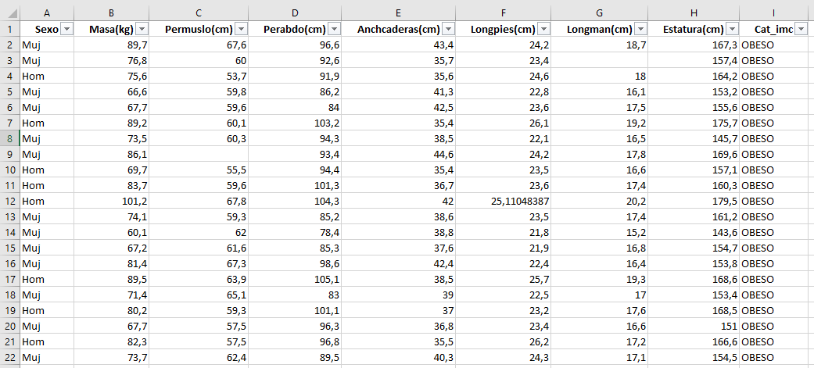
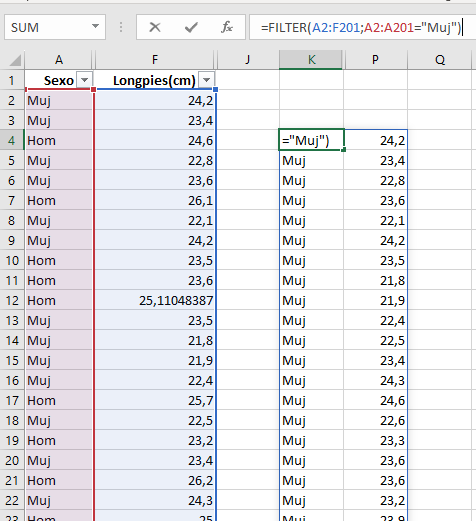
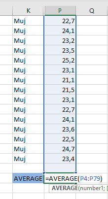
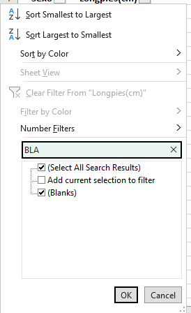
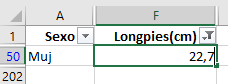
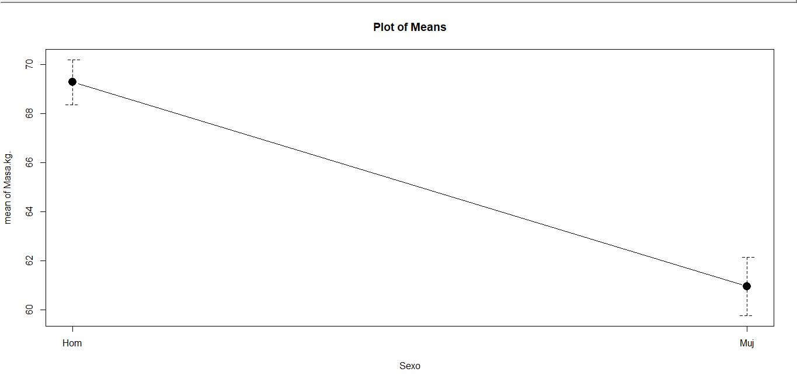

```{r setup, include=FALSE}
knitr::opts_chunk$set(echo = TRUE)
```

```{r, echo = FALSE, message = FALSE}
library(magrittr)
library(splitstackshape)
library(aplpack)
library(biotools)
library(car)
library(carData)
library(cluster)
library(ClustOfVar)
library(factoextra)
library(tidyverse)
library(MASS)
library(MVN)
library(tcltk)
library(TeachingDemos)
library(scatterplot3d)
library(GGally)
library(crosstable)
```

```{r, echo = FALSE}
colores <- c("#20dad8","#20a0d8","#155f91","#12253f","#120907")
```

```{r, echo = FALSE}
uno <- read.table("data.txt", header=T, sep=",")
```


# Introduccion

La base de datos con la que trabajaremos corresponde a las medidas antropométricas de la población laboral colombiana (ACOPLA) la cual se compone de 2100 registros y un total de 9 variables, las cuales son:


- **Sexo:** (Homb, Muj)

- **P1: ** (Masa corporal en Kg)

- **P7:** (Perímetro muslo mayor, en cm)

- **P16:** (Perímetro abdominal cintura, en cm)

- **P22:** (Anchura de las caderas, en cm)

- **P27:** (Longitud promedio de los pies, en cm)

- **P29:** (Longitud promedio de las manos, en cm)

- **P38:** (Estatura, en cm) 

- **CAT_IMC:** (DELGADO, NORMAL Y OBESO)

Procederemos a analizar estas variables a nivel univariado y multivariado, con la intencion de encontrar patrones, anamolias, entre otras cosas.

En primera instancia y antes de empezar a trabajar con la base de datos, decidimos cambiar el nombre de las variables para una mayor practicidad. Las mismas quedaron de la siguiente manera:


- Sexo

- Masa(kg)

- Permuslo(cm)

-Perabdo(cm)

- Anchcaderas(cm)

- Longpies(cm)

- Longman(cm)}

- Estatura(cm)

- Cat_imc

El segundo paso fue seleccionar una muestra aleatoria de 200 registros, la cual generamos fijando una semilla de la cual su numero es el numero de cedula del estudiante Juan Diego Espinosa Hernandez, este es el codigo con el cual realizamos este procedimiento:


```{r}
genera <- function(cedula){
set.seed(cedula)
aux <- stratified(uno, "CAT_IMC", 200/2100, bothSets=T)
mue <- aux$SAMP1
mue
}
```

```{r}
datos <- genera(1000192466)
```


Posterior a esto y ya teniendo nuestra muestra aleatoria procedimos a hacer la respectiva conversion de variables Sexo y Cat_imc a tipo factor, esto para que el R entendiera que son variables categoricas.


```{rm echo = FALSE}
datos$Sexo <- as.factor(datos$Sexo)
datos$CAT_IMC <- as.factor(datos$CAT_IMC) 
```

```{r, echo = FALSE}
datosf <- data.frame(datos)
colnames(datosf) <- c("Sexo","Masa(kg)","Permuslo(cm)", "Perabdo(cm)",
                    "Anchcaderas(cm)","Longpies(cm)","Longman(cm)",
                    "Estatura(cm)","Cat_imc")
```

# 1) Para todas sus variables realice un análisis exploratorio gráfico e identifique posibles valores atípicos u otro tipo de anomalías. (Para las variables Categóricas diagramas de barras, para las continuas o discretas, use Histogramas y/o Boxplot). Comente brevemente.

Para este apartado procederemos a realizar un analis de cada variable de forma individual.

## Sexo


```{r, echo = FALSE, warning=FALSE}
porcentaje <- prop.table(table(datosf$Sexo)) * 100

# Crear el gráfico de barras con etiquetas de porcentaje y escala de y aumentada
ggplot(datosf, aes(x = Sexo, fill = Sexo)) +
  geom_bar() +
  geom_text(stat = "count", aes(label = scales::percent(..count.. / sum(..count..), accuracy = 0.1)), vjust = -0.5) +
  labs(
    title = "Sexo",
    x = "Sexo",
    y = "Frecuencia"
  ) +
  theme_minimal() +
  scale_y_continuous(limits = c(0, 150)) +  # Cambia el tema del gráfico
  theme(panel.background = element_rect(fill = "lightgray"),  # Elimina los nombres en el eje x
        plot.title = element_text(hjust = 0.5),  # Centra el título del gráfico
        axis.title.x = element_text(hjust = 0.5)) + theme_minimal()
```

```{r, echo=FALSE}
knitr::kable(table(is.na(datosf[,1])), format = "markdown", caption = "NAs metrica Sexo")
```

La variable 'sexo' se compone de dos niveles: 'hombres' y 'mujeres', que se distribuyen en un 65.5% y un 37.5%, respectivamente. Es importante destacar que con la tabla podemos confirmar que no se registran datos faltantes en esta variable, como se muestra en la gráfica o la tabla correspondiente.

## Masa


```{r, echo = FALSE}
v2 <- boxplot(datosf$`Masa(kg)`, col = colores[1], horizontal = F, main = "Masa(kg)",ylab = "Frecuencia")
```


```{r, echo = FALSE}
knitr::kable(table(is.na(datosf[,2])), format = "markdown", caption = "NAs metrica  Masa")
```

```{r, echo = FALSE}
knitr::kable(data.frame("Valores atipicos" = v2$out), format = "markdown", caption = "metrica masa")

```

La variable 'masa' en el boxplot revela la existencia de datos atípicos, es decir, valores que se encuentran a más de 1.5 veces el rango intercuartil, para eso identificamos el dato en la base de datos y como lo pendemos ver en la tabla(), solo hay un dato el cual mirando su valores en sus demas variables y podemos concluir que el dato tiene total coherencia. Todas las mediciones relacionadas con su físico se corresponden con el perfil de una persona obesa. Aunque no contamos con un dato previo sobre la "longman", su inclusión no afecta nuestra decisión. Por tanto, hemos determinado que el dato es correcto y no constituye una anomalía, ademas hay presencia de NaN

## Perímetro muslo mayor(cm)

```{r, echo = FALSE}
v3 <- boxplot(datosf[,3], col = colores[1], horizontal = F, main = "Perímetro muslo mayor(cm)", ylab = "Frecuencia")

```

```{r, echo = FALSE}
knitr::kable(table(is.na(datosf[,3])), format = "markdown", caption = "Conteo NAs  Perímetro muslo mayor(cm)")
```

Como se puede observar en la tabla, existe un dato faltante en esta variable, por lo que procederemos a imputarlos. Además, en el gráfico se evidencia que no hay datos atípicos que superen 1.5 veces el rango intercuartil.

## Perímetro abdominal cintura(cm)

```{r, echo = FALSE}
v4 <- boxplot(datosf[,4], col = colores[1], horizontal = F, main = "Perímetro abdominal cintura(cm)", ylab = "Frecuencia")
```

```{r, echo = FALSE}
knitr::kable(table(is.na(datosf[,4])), format = "markdown", caption = "Conteo NAs metrica Perímetro abdominal cintura(cm)")
```

En el gráficos, podemos observar que ocurre lo mismo que con la variable 'Perímetro muslo mayor(cm)': no se encuentran datos atípicos. Sin embargo, al examinar la tabla, podemos notar que existen 2 valores faltantes (NAs) que requieren imputación.

## Anchura de las caderas

```{r, echo = FALSE}
v5 <- boxplot(datosf[,5], col = colores[1], horizontal = F, main = "Anchura de las caderas", ylab = "Frecuencia")

```


```{r, echo = FALSE}
knitr::kable(table(is.na(datosf[,5])), format = "markdown", caption = "NAs metrica ancho caderas")
```

```{r, echo = FALSE}
knitr::kable(data.frame("Atipicos" = v5$out), format = "markdown", caption = "Ancho caderas")

```

En el gráfico existen 2 valores, por lo que es necesario verificar si realmente cumplen con esta clasificación. En cuanto a la presencia de valores NAs, no encontramos ninguno en la variable. Además, respecto a los datos atípicos, se identificaron dos, pero es importante destacar que después de un análisis más detenido, concluimos que estos datos no pueden ser considerados atípicos. Todas las variables en estos registros son muy similares y concuerdan con las características esperadas en la realidad.

## Longpies (cm)

```{r, echo = FALSE}
boxplot(datosf[,6]  , col = colores[1], main = "Longpies(cm)", ylab = "Frecuencia")
```

```{r, echo = FALSE}
knitr::kable(table(is.na(datosf[,6])), format = "markdown", caption = "Conteo NAs ancho cadera")
```

Como podemos ver en la tabla, existen 2 valores que faltan (NAs) para esta metrica, por lo tanto posteriormente proceremos a imputarlos ademas en el boxplot no hay valores que esten a mas de 1.5 veces del rango intercuartil (valores atipicos).

## Longmano (cm)

```{r, echo = FALSE}
boxplot(datosf[,7]  , col = colores[1], main = "Longmano (cm)", ylab = "Frecuencia")
```

```{r, echo = FALSE}
knitr::kable(table(is.na(datosf[,7])), format = "markdown", caption = "Conteo NAs ancho cadera")
```

```{r, echo = FALSE}
a <- boxplot(datosf[,7]  , col = colores[1])

knitr::kable(data.frame("Valores atipicos" = sort(a$out), format = "markdown", caption = "Longmano (cm)"))
```

En este podemos ver igual que vimos en metricas anteriores hay 2 valores faltantes, mas adelante tendremos que imputar estos datos, ademas de esto en el boxplot existen valores atipicos (valores a mas de 1.5 veces del rango interquartil).

## Estatura (cm)

```{r, echo = FALSE}
boxplot(datosf[,8]  , col = colores[1], main = "Estatura(cm)", ylab = "Frecuencia")
```

```{r, echo = FALSE}
knitr::kable(table(is.na(datosf[,8])), format = "markdown", caption = "Conteo NAs ancho cadera")
```

Como podemos ver, hay un NA en este caso, por lo tanto mas adelante procederemos a imputar el dato, por ultimo para este caso no hay valores atipicos.

## IMC

```{r, echo = FALSE}
porcentaje <- prop.table(table(datosf$Cat_imc)) * 100

# Crear el gráfico de barras con etiquetas de porcentaje y escala de y aumentada
ggplot(datosf, aes(x = Cat_imc, fill = Cat_imc)) +
  geom_bar() +
  geom_text(stat = "count", aes(label = scales::percent(..count.. / sum(..count..), accuracy = 0.1)), vjust = -0.5) +
  labs(
    title = "IMC",
    x = "Sexo",
    y = "Frecuencia"
  ) +
  theme_minimal() +
  scale_y_continuous(limits = c(0, 200)) +  # Cambia el tema del gráfico
  theme(panel.background = element_rect(fill = "lightgray"),  # Elimina los nombres en el eje x
        plot.title = element_text(hjust = 0.5),  # Centra el título del gráfico
        axis.title.x = element_text(hjust = 0.5)) + theme_minimal()
```

```{r, echo = FALSE}
knitr::kable(table(is.na(datosf[,5])), format = "markdown", caption = "Conteo NAs ancho cadera")
```

En este caso no hay valores faltantes, por lo tanto no nos tendremos que preocupar por imputacion de datos, en el grafico de barras podemos ver las frecuencias y los porcentajes de cada categoria, con un total de 155 personas (77.5%) el indice de masa corporal normal es el mas comun en los trabajadores, lo cual esto nos puede indicar buena alimentacion y salud.

# 2) Realice el respectivo proceso de imputación para los datos faltantes en su base de datos. Explique cómo realiza dicha imputación, cuál criterio utiliza y muestre un par de ejemplos ilustrativos. 

Como identificamos en el punto anterior, tenemos valores faltantes en las siguientes variables: Longpies, Longmano, Estatura.

## Masa

```{r, echo = FALSE}
knitr::kable(datosf[which(is.na(datosf[,2])),],format = "markdown", caption = "Valores faltantes Masa")
```

Despues de ubicar el la fila del NaN ya que solo es uno, realizaremos un boxplot para saber si hay diferencias entre genera ya que nuestro datos pertenece a un hombre


```{r, echo=FALSE}
boxplot(datosf[,2]~datosf[,1], main="Genero vs masa", col = colores[1], xlab = "Genero", ylab = "Masa")
```

Como evidenciamos que no hay una diferencia significativa entre el genero y la masa, entonces descriminaremos por CAT_IMC para saber si la categoria NORMAL tiene diferencias con los demas


```{r, echo = FALSE}
boxplot(datosf[,2]~datosf[,9], main="IMC vs masa", col = colores[1], xlab = "IMC", ylab = "Masa")

```

En este caso solo hay diferencias entre DELGADO y los demas pero con nuestro Nivel immportante no hay direncia como los demas, entonces haremos un promedio entre NORMAL y OBESO ya que como vimos no hay diferencias entre estas y lo mismo paso con genero entonces el promedio asi es una buena aproximación

```{r, echo = FALSE}
df_filtrado <- data.frame(datosf[ !datosf$`Masa(kg)`=="DELGADO",])
```

```{r, echo = FALSE}
knitr::kable(as.data.frame(datosf[which(is.na(datosf[,2])),]), format = "markdown", caption = "Registros con valores faltantes")

```

```{r, echo=FALSE}
df_filtrado <- datosf %>%
  filter(!is.na(`Masa(kg)`), Cat_imc %in% c("NORMAL", "OBESO"))

mediaa <- mean(df_filtrado$`Masa(kg)`)

datosf <- datosf %>%
  mutate(`Masa(kg)` = ifelse(is.na(`Masa(kg)`), mediaa, `Masa(kg)`))
```

```{r, echo = FALSE}
knitr::kable(as.data.frame(datosf[41,]), format = "markdown", caption = "Imputacion")
```

## Permuslo

Por experiencia sabemos que mientras mayor peso tengan las personas, su masa en todas las partes del cuerpo aumenta, esto va muy relacionado al porcentaje de grasa corporal, asi que podriamos pensar que el IMC es significativo para explicar el perimetro del muslo, por otro lado con respecto al sexo, las mujeres pueden tener piernas mas gruesas, pero tampoco es que sea una regla general, asi que por este lado y de forma empirica no tenemos conocimiento como para dar un juicio a posteriori, sin embargo tenemos los datos para confirmar o desestimar las teorias.

```{r, echo=FALSE}
boxplot(datosf[,3]~datosf[,1], main="Genero vs Perimetro del muslo", col = colores[1], xlab = "Genero", ylab = " Perimetro del muslo")
```

Como podemos ver no hay una diferencia significativa entre ambos grupos con respecto a esta caracteristica, asi que en la imputacion no es necesario discriminar por hombre o mujer segun el caso para hacer la imputacion.


```{r, echo = FALSE}
knitr::kable(as.data.frame(datosf[which(is.na(datosf[,3])),]), format = "markdown", caption = "Registro con valores faltantes en la metrica")
```

```{r, echo = FALSE}
boxplot(datosf[,3]~datosf[,9], main="IMC vs Perimetro del muslo", col = colores[1], xlab = "IMC", ylab = " Perimetro del muslo")

```

Con respecto al IMC, podemos ver que hay diferencia significativa entre las 3 categorias, por lo tanto y ya que la mujer a la cual le falta la metrica esta clasificada como mujer obesa, entonces calcularemos la media de las personas obesas y con esto imputaremos el dato.


```{r, echo = FALSE}
f_filtrado1 <- datosf %>%
  filter(!is.na(`Permuslo(cm)`), Cat_imc %in% c("OBESO"))
medianaa <- median(f_filtrado1$`Permuslo(cm)`)
datosf <- datosf %>%
  mutate(`Permuslo(cm)` = ifelse(is.na(`Permuslo(cm)`), mediaa, `Masa(kg)`))
```

```{r, echo = FALSE}
knitr::kable(as.data.frame(datosf[8,]), format = "markdown", caption = "Imputacion")
```


## Pared abdominal

Con esta metrica, por experiencia no debemos asumir que alguna diferencia significativa entre ambos sexos, seria algo mas relacionado al IMC.

```{r, echo=FALSE}
boxplot(datosf[,4] ~ datosf[,1], col = colores[1])
```

```{r, echo = FALSE}
knitr::kable(as.data.frame(datosf[which(is.na(datosf[,4])),]), format = "markdown", caption = "Imputacion")
```


Como no hay diferencia significativa entre hombres y mujeres, para la imputacion no tendremos que discrimar por sexos

```{r, echo=FALSE}
boxplot(datosf[,4] ~ datosf[,9], col = colores[1], xlab = "IMC", ylab = "Pared abdominal", main = "Pared abdominal VS IMC")
```

Entre normal y obeso no vemos una diferencia significativa totalmente clara, por lo tanto tomaremos la media excluyendo a los que tienen el IMC correspondiente a DELGADO.

```{r, echo = FALSE}
knitr::kable(as.data.frame(datosf[which(is.na(datosf[,4])),]), format = "markdown", caption = "Imputacion Pared abdominal (cm)")
```

```{r, echo = FALSE}
df_filtrado <- datosf %>%
  filter(!is.na(`Perabdo(cm)`), Cat_imc %in% c("OBESO"))

mediaa <- mean(df_filtrado$`Perabdo(cm)`)

datosf <- datosf %>%
  mutate(`Perabdo(cm)` = ifelse(is.na(`Perabdo(cm)`), mediaa, `Perabdo(cm)`))
```

```{r, echo=FALSE}
knitr::kable(as.data.frame(datosf[177,]), format = "markdown", caption = "Imputacion Pared abdominal")
knitr::kable(as.data.frame(datosf[28,]), format = "markdown", caption = "Imputacion Pared abdominal")
```

## Longpies

De forma empirica sabemos que normalmente la longitud de los pies de los hombres es mayor, ya que en su mayoria tienen un tallaje mayor que el de las mujeres. Este supuesto nos da una idea de que pueda haber una diferencia entre hombres y mujeres con respecto a esta caracteristica, pero hay que visualizar los datos para ver realmente en nuestro caso que pasa.

```{r, echo = FALSE}
boxplot(datosf[,6] ~ datosf[,1], col = colores[1], xlab = "Sexo", ylab = "Longpies", main = "Longpies VS Sexo")
```

Como podemos en el boxplot la cajas no se traslapan, por lo tanto hay una diferencia significativa entre ambos grupos, ademas de esto, cabe recalcar que para el caso de los hombres se ve bastante simetrica la distribucion de los datos por lo tanto la mediana y la media deberian de darnos valores muy parecidos (cercanos entre si) o iguales (en el caso en el que sea completamente simetrico) asi que no va a haber una diferencia significativa entre imputar con uno o otro, pero para el caso de las mujeres podemos ver que la distribucion de los datos no es simetrica, por lo tanto hay que mirar este caso con mas detenimiento y asi determinar que metodo usar, asi que imputaremos el dato a traves de la media, dependiendo del sexo a el que pertenezca la persona.

Estos son los registros que tienen ausencia de esta metrica (NAs).

```{r, echo = FALSE}
knitr::kable(as.data.frame(datosf[which(is.na(datosf[,6])),]), format = "markdown", caption = "Imputacion Longman (cm)")
```

### Usando R para imputar datos

**Paso 1:**

Para hacerlo de una forma mas simple, sacaremos una sub base de datos en la cual solo existiran 2 columnas las cuales son: Sexo y Longpies(cm).

```{r}
nb1 <- subset(datosf, select = c("Sexo","Longpies(cm)"))

knitr::kable(head(nb1), format = "markdown", caption = "Head Longpies(cm)")
```

**Paso 2**

La imputacion para el hombre la haremos con R, en el caso de la mujer lo haremos con excel.

**Imputacion registro 11, sexo:Hombre**

Para probar la hipotesis que planteamos al principio, tambien haremos el calculo de la mediana.

```{r}
imput1 <- filter(nb1, Sexo == "Hom")

knitr::kable(data.frame( "Mean" = mean(imput1$`Longpies(cm)`, na.rm = TRUE ), 
            "Median" = median(imput1$`Longpies(cm)`, 
                              na.rm = TRUE )),
            format = "markdown", caption = "Media y Medina hombres")
```

Finalmente nos quedaremos con la media ya que no existen valores atipicos los cuales nos lleven a pensar acerca de usar la mediana.

**Paso 3: Imputacion**

Ahora solo queda que busquemos el registro en la base de datos y lo imputamos con el valor de la media ya calculado.

```{r}
datosf[11,6] <- mean(imput1$`Longpies(cm)`, na.rm = TRUE ) 
```

```{r}
knitr::kable(as.data.frame(datosf[11,]), format = "markdown", caption = "Imputacion Longman (cm)")
```

### Imputando datos con excel

Primero exportamos nuestra base de datos desde R con el siguiente codigo: **writexl::write_xlsx(datosf,"datos.xlsx")**

Habrimos excel:



Ocultamos el resto de columnas que no nos son utiles para este caso y solo degamos la columna Sexo y Longpies(cm), despues de esto procedemos a usar la funcion **FILTER** (hay que tener en cuenta que en este caso el excel esta en ingles, por lo tanto para el caso en español o otros idiomas cambia la palabra) para crear una tabla en la cual filtraremos por el la columna Sexo por el valor **"Muj"**



Luego calculamos el promedio con la funcion **AVERAGE**, lo haremos con esta ya que no hay valores atipicos los cuales puedan afectar la estimacion de la media



Despues de tener el valor filtramos en la columna sexo por los valores vacios



Y procedemos por ultimo a imputar el dato, es muy importante saber lo siguiente, que en el caso de excel nuestro dato faltante esta en la fila **50**, ya que la primera fila para nosotros son los nombres de las columnas, en cambio en R los registros empiezan desde el numero 1.



```{r, echo=FALSE}
imput1 <- filter(nb1, Sexo == "Muj")
datosf[49,6] <- mean(imput1$`Longpies(cm)`, na.rm = TRUE ) 
```

## Longmano

Por la experiencia y lo vemos dia a dia, sabemos que las manos de las mujeres son mas pequeñas que las de los hombres, y tambien es algo escaso cuando un hombre tiene la mano mas pequeña que la de la mujer, asi que el dia a dia nos indica que puede haber una diferencia significativa entre ambos sexos, ahora veremos los datos para corroborar nuestro hipotesis.

```{r, echo=FALSE}
boxplot(datosf[,7] ~ datosf[,1], col = colores[1], xlab = "Sexo", ylab = "Longmano", main = "Longmano VS Sexo")
```

Como las cajas no se traslapan, confirmamos nuestra hipotesis empirica y por lo tanto hay una diferencia significativa entre hombres y mujeres en la medida de la longitud de la mano

**Registros con los valores faltantes**

Como en el caso anterior, un registro faltante corresponde a mujeres y el otro a hombres, asi que hay que sacar la media de cada grupo y hacer la imputacion al registro que corresponde a dicho grupo.

```{r, echo = FALSE}
knitr::kable(as.data.frame(datosf[which(is.na(datosf[,7])),]), format = "markdown", caption = "Imputacion Longman (cm)")
```

```{r, echo = FALSE}
nb2 <- subset(datosf, select = c("Sexo","Longman(cm)"))
```

```{r, echo=FALSE}
imput2 <- filter(nb2, Sexo == "Hom")

```

```{r, echo=FALSE}
datosf[192,7] <- mean(imput2$`Longman(cm)`, na.rm = TRUE ) 
```

```{r, echo = FALSE}
knitr::kable(as.data.frame(datosf[192,]), format = "markdown", caption = "Imputacion Longman (cm)")
```

```{r, echo=FALSE}
imput3 <- filter(nb2, Sexo == "Muj")

```

```{r, echo=FALSE}
datosf[2,7] <- mean(imput3$`Longman(cm)`, na.rm = TRUE ) 
```

```{r, echo = FALSE}
knitr::kable(as.data.frame(datosf[2,]), format = "markdown", caption = "Imputacion Longman (cm)")
```

## Estatura

Dia a dia vemos como las mujeres son mas bajas en comparacion a los hombres, por ejemplo en la mayoria de los casos un hijo varon supera la estatura de su mama facilmente y la de sus compañeras de clase, trabajo, etc y para el caso de las mujeres es bastante atipico que alguna mida 190 cm o 185 cm, en cambio en un hombre, aunque no es comun, si es mas logico en ellos y ademas mas comun en comparacion a las mujeres. Veremos los datos para probar o desmentir esta hipotesis

```{r, echo = FALSE}
boxplot(datosf[,8] ~ datosf[,1], col = colores[1], xlab = "Sexo", ylab = "Estatura", main = "Estatura VS Sexo")
```

Aqui como en los otros casos vemos una diferencia signicativa entre ambos grupos ya que las cajas no se traslapan y por lo tanto, para imputar el dato hay que hacer calculo grupo por grupo. Y hay que tener en cuenta otra cosa, que en ambos hay valores atipicos, y tampoco es algo como muy extremo.

```{r, echo = FALSE}
knitr::kable(as.data.frame(datosf[which(is.na(datosf[,8])),]),format = "markdown",caption = "Faltantes Estatura")
```

en nuestro caso el dato faltante corresponde a una mujer y como vimos en el diagrama de boxplot hay 2 valores atipicos, los cuales son: **169.6 y 143.6**, estos dos como estan en lados contrarios, entonces de alguna forma equilibran la carga en la media. Para probar esto haremos lo siguiente: calcularemos la media con y sin valores atipicos y veremos si hay una diferencia significativa.

```{r, echo = FALSE}
nb3 <- subset(datosf, select = c("Sexo","Estatura(cm)"))
```

```{r, echo=FALSE}
imput3 <- filter(nb3, Sexo == "Muj")
```

**Sin valores atipicos**

```{r,echo=FALSE}
mean(imput3$`Estatura(cm)`, trim = 0.02, na.rm = TRUE)
```

**Con valores atipicos**

```{r,echo=FALSE}
mean(imput3$`Estatura(cm)`, na.rm = TRUE)
```

Como podemos ver la diferencia no fue significativa, por lo tanto procederemos con la media.

```{r, echo=FALSE}
datosf[199,8] <- mean(imput3$`Estatura(cm)`, na.rm = TRUE ) 
```

```{r, echo = FALSE}
knitr::kable(as.data.frame(datosf[199,]), format = "markdown", caption = "Imputacion Estatura (cm)")
```

# 3) Considere las variables P1, P29 y P38. ¿Se puede afirmar que cada variable por separado permitiría discriminar entre Hombres y Mujeres? Elabore los resúmenes numéricos y gráficos que considere pertinentes para responder la pregunta.

Como modificamos el nombre de las columnas, entonces para nuestro caso en vez de P1, P29 y P38 seran: Masa(kg), Longman(cm) y Estatura(cm).

## Masa(kg)

```{r, echo=FALSE}
boxplot(datosf$`Masa(kg)` ~ datosf$Sexo, col = colores[1], xlab = "Sexo", ylab = "Masa", main = "Masa VS Sexo")
```

Como las cajas no se traslapan, entonces no hay una diferencia significativa entre ambos grupos, por lo tanto procederemos a realizar el diagrama de medias.




En el diagrama de medias podemos ver que si hay una diferencia significativa entre ambos generos, la media es mas alta para los hombres que para las mujeres y no hay traslape, por lo tanto podemos concluir que son diferentes y que se puede diferenciar entre ambos grupos con la variable Masa(Kg)

## Longman(cm)

```{r, echo=FALSE}
boxplot(datosf$`Longman(cm)` ~ datosf$Sexo, col = colores[1], xlab = "Sexo", ylab = "Longman", main = "Longman VS Sexo")
```

Como los boxplot no se traslapan, entonces podemos afirmar que la variable Longman, nos permite discriminar entre ambos sexos

## Estatura(cm)

```{r, echo=FALSE}
boxplot(datosf$`Estatura(cm)` ~ datosf$Sexo, col = colores[1], xlab = "Sexo", ylab = "Estatura", main = "Estatura VS Sexo")
```

Como los boxplot no se traslapan, entonces podemos afirmar que la variable Estatura(cm), nos permite discriminar entre ambos sexos


# 4) Usando las variables continuas, realice un gráfico de dispersión para identificar posibles relaciones entre sus variables. Explique si lo que se observa gráficamente tiene sentido o es coherente a la luz de sus datos. Corrobore lo observado con el cálculo de la matriz de correlaciones. Comente. Repita el proceso discriminando por SEXO. ¿Hay cambios en las estructuras de Covarianzas para ambos grupos? Comente

### PARTE 1

La idea es crear gráficos de dispersión de puntos para cada variable, a excepción de las variables categóricas 'Sexo' y 'Cat_imc'. Esto nos permitirá visualizar posibles correlaciones o tendencias entre las diferentes variables numéricas.


```{r, echo=FALSE}
datosf1 <- datosf[,-c(1,9)]
```

```{r, echo=FALSE}
pairs(datosf1)
```


- Masa: se puede observa en la comparacion con las demas variables que tienen una  relacion lineal creciente, pero con la que parece tener una gran correlacion es con el perimero del muslo y adbdomen ya que forma una gran liena recta perfecta, ya con los demas variables su gran comportamiento es muy parecido un poco mas de dispersion pero es relativa ahora la cosa es que aunque parezcan tener relacion ya debemos de mirar si tiene sentido como es el caso de la masa respecto a permuslo, perabdo, anchcadera y estatura con estas variables por conocimiento previo sabemos que entre mayor se su unidad de medida mas masa tendra con la persona, lo que no pasa con longitud de la manos y pies ya que no estoy depende mas del desarrollo de la persona y no influyen significativamente en la masa


- permuslo: como ya lo habiamos observado tiene una gran relacion con la masa y sigue la misma dispersion con la demas variable como fue en el caso de la masa, aunque en este caso comparten las mismas diferencia hay que notar que la estatura no influye mucho aunque parezca una gran relacion y ese el perimetro del muslo depende mas de la masa.

- perabdomen: paso lo mismo, solo que esta ves su relacion es mas notoria con la masa  y el perimetro del muslo, las demas siguen una dispercion, similar, otraves siendo longuitud de las manos y los pies en el escenario de mirar sentido a la relacion es la que no tiene un sentido

ancho de canderas: en esta lo que pasa es que tiene un tendencia similar en casi en todad  sus comparaciones con las demas variables  pero siendo otra vez longitud de pies y de manos adicionalmente la estatura la que se nota una diferencia en sus dispersion con las demas

- longitud de las manos: como lo vimos con las demas variables que aunque tenga una buena relacion con alguna variables y con otras no tanto, pero en el sentido de coherencia entre ella no tienen, pero este caso si se nota un gran relacion entre la longitud de las manos y la estatura y ademas tiene coherencia 

- longitud de las pies: en este casos es lo mismo qe con la longitud de las manos por lo que la intrepetaciones son la misma

- Estatura:  pasa lo mismo que con las longitud de las manos y longitud de los pies


### correlacion.

ahora todas estas concluisnes fueron a traves del analisis de las graficar para vericar estos argumento haremos la matriz te correlacion para saber que tan correlacionadas esta y refuntan  nuestros cometarios anteriores

```{r, echo=FALSE}
cor(datosf1)
```

La matriz de correlación confirma nuestras observaciones previas en los gráficos de dispersión. Las variables que identificamos como teniendo una fuerte relación lineal en los gráficos de dispersión muestran correlaciones significativamente altas en la matriz de correlación. Por otro lado, las variables que mostraban más dispersión en los gráficos tienen correlaciones menos pronunciadas.

Además, las variables que mencionamos como carentes de sentido en relación con otras presentan correlaciones efectivamente bajas en la matriz de correlación. Este análisis respalda nuestras conclusiones previas sobre las relaciones entre las variables.

### PARTE 2

Ahora nuestro interes es ver estas relaciones pero con respecto al genero

```{r, echo=FALSE}
datosf11 <- datosf[,-c(9)]
ggpairs((datosf11),
        columns = 2:8,
        aes(color = Sexo, alpha = .5))+
  scale_color_manual(values = c("dodgerblue", "tomato"))+
  scale_fill_manual(values = c("dodgerblue", "tomato"))
```


- En cuanto a la variable 'Masa', al observar los gráficos de dispersión, es evidente una fuerte relación lineal tanto en hombres como en mujeres en relación con el 'Perímetro del muslo.' Sin embargo, a través de las correlaciones, notamos una diferencia  entre géneros. En hombres, la relación entre estas dos variables es considerablemente más alta, llegando a una correlación cercana a 1. Por otro lado, en mujeres, aunque también hay una relación lineal, la correlación es ligeramente menor.

Además, notamos otra relación lineal, aunque un poco menor, entre 'Masa' y el 'Perímetro abdominal.' Aunque la correlación en este caso no supera 0.9, marca una diferencia significativa entre otras variables. Nuevamente, los hombres muestran una relación más fuerte en comparación con las mujeres en esta variable.


- En el caso del 'Perímetro del muslo,' además de su fuerte relación con la 'Masa,' también observamos una relación similar con el 'Perímetro abdominal.' La correlación entre 'Perímetro del muslo' y 'Perímetro abdominal' es comparable a la de 'Masa' y 'Perímetro abdominal.' Sin embargo, nuevamente, notamos que los hombres muestran una relación más pronunciada en comparación con las mujeres en esta variable.


- En relación al 'Perímetro abdominal,' observamos una tendencia similar a la 'Masa' y al 'Perímetro del muslo,' ya que presenta una relación inversa con ambas variables. Sin embargo, en este caso, la correlación entre 'Perímetro abdominal' y 'Masa' es baja, al igual que la correlación entre 'Perímetro abdominal' y 'Perímetro del muslo.'

Ninguna de las otras variables, ya sea a través de sus gráficos de dispersión o en la matriz de correlación, muestra una relación significativa con el 'Perímetro abdominal,' y sus correlaciones también son bajas.


- En cuanto al 'Ancho de caderas,' observamos una tendencia interesante: los hombres muestran una relación más lineal en los gráficos de dispersión en comparación con las mujeres en relación a las variables 'Masa,' 'Perímetro del muslo,' y 'Perímetro abdominal.' Además, las correlaciones en los hombres, aunque no superan 0.8, indican una relación más fuerte en estas variables en comparación con las mujeres.

Sin embargo, ninguna de las otras variables, ya sea a través de sus gráficos de dispersión o en la matriz de correlación, muestra una relación significativa con el 'Ancho de caderas,' y sus correlaciones también son bajas

- En el caso de 'Longitud de los pies,' aunque los gráficos de dispersión no revelan una relación destacada de ningún género con una variable específica, podemos notar que algunas variables tienen una correlación alta en conjunto. Por ejemplo, 'Longitud de los pies' muestra una relación significativa con 'Estatura.' En este sentido, los hombres tienen una correlación ligeramente más fuerte en 'Longitud de los pies,' mientras que las mujeres presentan una mejor correlación con 'Estatura. 

- En el caso de la 'Longitud de las manos,' observamos una tendencia similar con respecto al género en comparación con 'Longitud de los pies.' Aunque los gráficos de dispersión no muestran una relación destacada entre ningún género y una variable específica, es evidente que 'Longitud de las manos' tiende a relacionarse más con 'Longitud de los pies' y 'Estatura.' Sin embargo, en el caso de 'Longitud de los pies,' se observa una relación ligeramente más fuerte en los hombres, lo cual se confirma en las correlaciones. Sorprendentemente, en el caso de 'Estatura,' aunque el gráfico sugiere una leve diferencia en favor de los hombres, la correlación es la misma para ambos géneros.

- En el caso de 'Estatura,' como mencionamos anteriormente en otros análisis, observamos que su relación más sólida se encuentra con 'Longitud de las manos' y 'Longitud de los pies.' En particular, en comparación con 'Longitud de los pies,' las mujeres muestran una correlación más alta con 'Estatura,' mientras que la correlación entre 'Estatura' y 'Longitud de las manos' es similar para ambos géneros.


En resumen, en la mayoría de los casos donde observamos relaciones significativas entre las variables analizadas, se evidencia que los hombres tienden a tener una relación un poco mayor en comparación con las variables estudiadas.

# 5) Elabore una tabla de porcentajes de doble entrada con las variables CAT_IMC y SEXO. Luego presente la información gráficamente. ¿Se puede afirmar que la distribución porcentual de la variable CAT_IMC es diferente para hombre y mujeres? Justifique su respuesta.  

```{r, echo=FALSE}
knitr::kable((table(datosf$Cat_imc,datosf$Sexo)/200)*100)
```

Según la gráfica y la tabla, al establecer un margen de error del 5%, podemos concluir que la categoría 'DELGADO' no supera este margen, ya que la diferencia es de 1.5. Sin embargo, en la categoría 'NORMAL,' la diferencia supera ampliamente el margen del 5%, siendo de 27.5.


```{r, echo= FALSE, warning = FALSE}
# Grafico


datos %>% count(Sexo, CAT_IMC) %>%
  mutate(percentaje = round(n/sum(n)*100,2)) %>%
  ggplot(aes(x = CAT_IMC, y = percentaje))+
  geom_col(aes(fill = Sexo), position = "dodge")+
  scale_fill_manual(values = c("dodgerblue", "tomato"))+
  xlab("IMC")+ylab("Porcentaje")+
  theme_minimal()
```


Esto podría sugerir, en términos generales, que los hombres tienden a mostrar una mayor propensión a caer en las categorías de IMC delgadas y normales, mientras que las mujeres presentan una mayor inclinación hacia la categoría de obesidad. Estas diferencias podrían estar relacionadas con variaciones en la composición corporal, el metabolismo o los patrones de alimentación entre hombres y mujeres.

# 6) Se tienen los siguientes datos de 5 personas, de las cuales se desconoce su CAT_IMC.

```{r}
# Pregunta 6 --------------------------------------------------------------

# Datos de los sujetos desconocidos
datos_desconocidos <- data.frame(
  P1 = c(66.1, 55.8, 62.8, 63.9, 50.7),
  P7 = c(53.9, 50.1, 54.3, 50.6, 46.3),
  P16 = c(73.8, 76.9, 80.4, 75.6, 72.7),
  P22 = c(34.7, 39.5, 37.5, 31.5, 30.4),
  P27 = c(27.6, 24.7, 23.5, 24.9, 23.5),
  P29 = c(20.9, 17.3, 16.5, 18.6, 16.7),
  P38 = c(181.6, 154.5, 156.6, 173.1, 159.5)
)

# Calcular las medias de cada variable para cada categoría de IMC en la base de datos original
medias_imc <- aggregate(. ~ CAT_IMC, data = na.omit(datos[,-c("Sexo")]), FUN = mean)

# Calcular la distancia euclidiana entre los sujetos desconocidos y
# las medias de cada categoría de IMC

list_cat <- list()
df <- data.frame()
for (j in 1:3) {
  for (i in 1:7) {
    df[1:5,i] <- sqrt((datos_desconocidos[,i]-medias_imc[j,i+1])^2)
  }  
  colnames(df) <- names(datos_desconocidos)
  rownames(df) <- paste0("sujeto_",1:5)
  list_cat[[j]] <- df
}

names(list_cat) <- medias_imc[,1]

list_cat <- lapply(list_cat, function(x) t(x))

# Crear un vector para almacenar las categorías asignadas a cada sujeto
categorias_asignadas <- character(length = nrow(datos_desconocidos))

# Recorrer cada sujeto y asignar la categoría con la menor diferencia
for (i in 1:nrow(datos_desconocidos)) {
  diferencias <- sapply(list_cat, function(matriz) sum(matriz[,i]))
  categoria_asignada <- names(list_cat)[which.min(diferencias)]
  categorias_asignadas[i] <- categoria_asignada
}

# Agregar las categorías asignadas al dataframe de sujetos desconocidos
datos_desconocidos$Categoria_Predicha <- categorias_asignadas

# Mostrar el dataframe con las categorías asignadas
print(datos_desconocidos)
```


En este trabajo, estamos tratando de predecir las categorías de Índice de Masa Corporal (IMC) para un grupo de sujetos desconocidos. Para hacerlo, utilizamos datos de personas cuyas categorías de IMC ya conocemos y luego aplicamos un algoritmo para asignar categorías de IMC a los sujetos desconocidos en función de sus mediciones corporales.

## Paso 1

Primero, recopilamos datos de los sujetos desconocidos, que incluyen mediciones de diferentes variables, como peso, altura, etc. Estos datos se almacenan en un conjunto de datos.

## Paso 2: Cálculo de Medias de IMC

Para determinar las categorías de IMC, necesitamos conocer las medias de estas categorías a partir de datos previos. Utilizamos un conjunto de datos original que contiene categorías de IMC y mediciones relacionadas. Luego, calculamos las medias de estas mediciones para cada categoría de IMC. Las categorías de IMC se identifican por un valor llamado `CAT_IMC`.

## Paso 3: Cálculo de Distancias Euclidianas

El corazón de nuestro algoritmo es calcular la distancia entre las mediciones de cada sujeto desconocido y las medias de cada categoría de IMC. Usamos la distancia euclidiana para hacer esto. Básicamente, comparamos las mediciones de cada sujeto con las medias de todas las categorías de IMC para ver cuál se ajusta mejor. Las distancias se almacenan en una estructura de datos llamada `list_cat`.

## Paso 4: Preparación de Datos para Asignación

Para hacer las cosas más claras y organizadas, transponemos las matrices de distancias calculadas en el paso anterior. Esto es necesario para que podamos comparar las mediciones de los sujetos desconocidos con las categorías de IMC de manera más eficiente.

## Paso 5: Asignación de Categorías

Ahora viene la parte crucial. Recorremos cada sujeto desconocido y calculamos la suma de las distancias euclidianas con todas las categorías de IMC. La categoría con la suma de distancias más pequeña se asigna a ese sujeto. Esto significa que estamos asignando al sujeto desconocido la categoría de IMC que mejor se ajusta a sus mediciones.

## Paso 6: Almacenamiento de Resultados

Finalmente, agregamos las categorías asignadas a los sujetos desconocidos al conjunto de datos original `datos_desconocidos` en una nueva columna llamada `Categoria_Predicha`. Esto nos permite ver las categorías de IMC asignadas a cada sujeto desconocido.

## Conclusión:

En resumen, mediante este proceso, hemos utilizado datos previos sobre categorías de IMC y mediciones corporales para asignar categorías de IMC a un grupo de sujetos desconocidos en función de sus propias mediciones. Esto podría ser útil en la clasificación de personas en categorías de peso.
