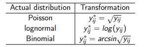

---
output:
  pdf_document: default
  html_document: default
---
```{r}

#Codigo para niveles del experimento
X <- factor(rep(c(35,40,45), each = 4))

# Hay que introducir los datos por filas
Y <- c(4.5,5.0, 5.5, 6.75, 6.5, 6.5, 10.5, 9.5, 9.75, 8.75, 6.5, 8.25)
```


```{r}
boxplot(Y ~ X)
```

# Anova

El valor P de la tabla anova nos dice si el modelo de regresion es significativo, o en otras palabras, si la covariable (predictora), tiene un efecto significativo en la variable respuesta (Y)


$$H_0: \tau_1 = \tau_2 = \tau_3 = 0$$

$$H_1: algun\ \tau \neq 0;\ i = 1, 2, 3$$

Aqui nos sirve rechazar $H_0$, para que el modelo sea significativo

```{r}
model = lm(Y ~ X)

anova(model)
```

Por ejemplo en este caso, nuestro valor **P = 0.042**, con un $\alpha = 0.05$ podemos decir que la covariable (X) es significativa para explicar el compartamiento de la variable respuesta (Y)


**SI EL FACTOR NO RESULTA SIGNIFICATIVO NO TIENE SENTIDO HACER COMPARACION DE MEDIAS**

# Supuesto varianza constante

$$H_0: \sigma_1^2 = \sigma_2^2 = \sigma_3^2$$

$$H_1: algun\ \sigma_i^2 \neq del\ resto$$

Para este caso, nos sirve aceptar $H_0$ para probar el supuesto de varianza constante

## Test

### Barlett test

```{r}
bartlett.test(Y ~ X)
```

Como el valor **P=0.4787** y con un $\alpha = 0.05$, no hay suficiente evidencia estadistica para rechazar la hipotesis nula, por lo tanto se acepta

### Levene test

```{r}
library(lawstat)
levene.test(Y, X)
```


## Residuals vs fitted values

```{r}
model = lm(Y~X)

plot(model,1)
```


## Notas

El enfoque habitual para tratar con varianza no constante es aplicar una transformación estabilizadora de la varianza y luego ejecutar el análisis de varianza de los datos transformados.



# Supuesto de normalidad

$$H_0: Los\ errores\ se\ distribuyen\ normal$$

$$H_1: Los\ errores\ NO\ se\ distribuyen\ normal$$

Para este caso nos sirve aceptar $H_0$ para cumplir con el supuesto de normalidad

```{r}
shapiro.test(model$residuals)
```


```{r}
qqnorm(model$residuals)
qqline(model$residuals, col = "red")
```

Como nuestro **valor p = 0.4046** y con un $\alpha = 0.05$ se acepta la hipotesis nula, por lo tanto los residuales se distribuyen normal


# Comparacion de medias

## Turkey's test

Supongamos que, después de un análisis de varianza en el que hemos rechazado los efectos de los tratamientos no significativos de la hipótesis nula, deseamos probar todas las comparaciones de medias por pares:

$$H_0: \mu_i = \mu_j$$

$$H_1: \mu_i \neq \mu_j$$

$$para\ todo\ i \neq j$$

Si vamos a compararar las medias de por ejemplo el nivel 15 y el nivel 20, entonces calculo:

$$d_{15-20} = | \bar{Y}_{15} - \bar{Y}_{20} |$$

Si $d_{15-20} > \tau_{\alpha}\  entonces\ se\ rechaza\ H_0$


De forma equivalente, podríamos construir un conjunto de intervalos de confianza del $100(1-\alpha)*100 \%$ para todos los pares de medias de la siguiente manera de confianza para todos los pares de medias como sigue: 

$$\bar{y}_i - \bar{y}_j - T_{\alpha} \leq \mu_i - \mu_j \leq \bar{y}_i - \bar{y}_j + T_{\alpha}$$

```{r}
X = factor(rep(c(15,20,25,30,35), each = 5))

Y = c(7, 7, 15, 11, 9, 12, 17, 12, 18,
18, 14, 18, 18, 19, 19, 19, 25, 22, 19, 23,
7, 10, 11, 15, 11)
```

```{r}
boxplot(Y ~ X)
```


```{r}
model <- aov(Y ~ X)

TukeyHSD(model)
```

Si el intervalo $(lwr,upr)$ **CONTIENE EL 0** esto quiere decir que no hay una diferencia significativa entre las medias, si por el contrario **NO CONTIENE EL 0** quiere decir que hay una diferencia significativa entre ambos medias

## LSD

Se rechaza $si\ el\ estadistico\ > LSD\ se\ rechaza\ H_0$


## Pairwese test

```{r}
pairwise.t.test(Y,X)
```

# CI for the contrast c1 = c2 = 1, c3 = 0, c4 = c5 = -1

```{r}
#CI for the contrast c1 = c2 = 1, c3 = 0, c4 = c5 = -1
n = 5
N = length(Y)
a = length(levels(X))
c0 = c(1, 1, 0, -1, -1)

df <- df.residual(model)
MSE <- deviance(model)/df

Yi.bar = tapply(Y, X, mean)
c0 = c(1, 1, 0, -1, -1)
li <- sum(Yi.bar*c0) - qt(0.975, N-a)*sqrt(MSE*sum(c0^2)/n)
ls <- sum(Yi.bar*c0) + qt(0.975, N-a)*sqrt(MSE*sum(c0^2)/n)
```

```{r}
tabla1 <- data.frame(
  "LI" = li,
  "LS" = ls
)

knitr::kable(tabla1)
```


# Notas importantes

- Como las ejecuciones del experimento se realizan de forma aletoria eso hace que tenga sentido pensar en el supuesto de independencia que asume el modelo

- En un estudio balanceado (mismo numero de replica por nivel) la prueba F sigue siendo robusta incluso si la varianza no es constante

- En algunos experimentos de un solo factor, el número de observaciones tomadas dentro de cada tratamiento puede ser diferente. Entonces decimos que el diseño está desequilibrado. Aún se puede utilizar el análisis de varianza ya descrito en la última clase.

Sin embargo, existen dos ventajas al elegir un diseño equilibrado. Primero, la prueba es relativamente insensible a pequeñas desviaciones del supuesto de varianzas iguales para los tratamientos a si los tamaños de muestra son iguales. En segundo lugar, la potencia de la prueba se maximiza si las muestras son del mismo tamaño.

- A veces, la varianza de las observaciones aumenta a medida que aumenta la magnitud de las observaciones. Esto sucede comúnmente con muchos instrumentos de medición. El error es un porcentaje de la lectura de la báscula.


Si se viola el supuesto de homogeneidad de varianzas, la prueba F sólo se ve ligeramente afectada en el diseño equilibrado que utiliza el modelo 3). sin embargo, en diseños desequilibrados el problema es más grave. Específicamente, si los niveles de factor que tienen las varianzas más grandes también tienen tamaños de muestra más pequeños, la tasa de error tipo I real es mayor de lo previsto (o los intervalos de confianza tienen niveles de confianza reales más bajos que los especificados).

Ésta es una buena razón para elegir tamaños de muestra iguales siempre que sea posible.

- En el modelo de efectos fijos las inferencia solo son validas para los niveles fijados

- En el modelo de efectos aleatorios las inferencias se pueden para valores en el rango de posibles niveles asi no se haya experimentado en el
