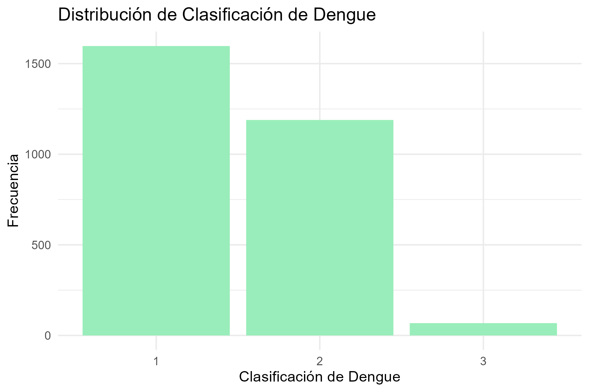

```{r setup, include=FALSE}
knitr::opts_chunk$set(echo = TRUE)
```

```{r, message=FALSE,echo=FALSE,warning=FALSE}
library(tidyverse)
library(ggplot2)
library(gridExtra)
library(grid)
```

# Abstract

The following study proposes a model that allows predicting whether or not a patient can be hospitalized, given that they already have dengue. Additionally, it takes into account the type of dengue that can be predicted for the patient, considering certain pathologies associated with known cases of dengue.

In order to achieve this, a logistic model with a Bayesian approach was used. This choice was made because our response variable comprises a categorical variable that is dichotomous, describing two types of dengue. Furthermore, categorical variables describing whether or not the patient has the associated symptoms were used as predictors. It should be clarified that both qualitative and quantitative variables can be added to the logistic model. The STAN programming language was used to perform this procedure since the posterior distribution cannot be found using conventional analytical methods. Therefore, it must be approximated through numerical methods. Finally, to compare models, the convergence of the model and the significance of the predictor variables are verified in advance.

# Introducción

El siguiente trabajo propone un modelo que permita predecir si un paciente puede ser o no hospitalizado dado que ya tiene un dengue, además de esto teniendo en cuenta que tipo de dengue que podamos predecir que posee el paciente, y todo esto teniendo en cuenta ciertas patologías asociadas a los casos de dengue conocidos.

Para hacer esto posible se utilizó un modelo logístico con un enfoque bayesiano, y se llevó a cabo esta elección ya que nuestra variable respuesta comprende una variable categórica la cual es de tipo dicótoma y describe 2 tipos de dengue, además de esto se utilizaron como predictoras variables categóricas que describen si el paciente posee o no el síntoma asociado, cabe aclarar que al modelo logístico se le pueden añadir tanto variables cualitativas como cuantitativas. Para llevar a cabo este procedimiento se utilizó el lenguaje de programación STAN ya que la distribución posterior no se halla con métodos convencionales (analíticamente) por lo tanto debe aproximarse a través de métodos numéricos. Para finalizar para hacer una comparación de modelos antes se verifica la convergencia del modelo y significancia de las variables predictoras.

# Glosario

**- Dolor abdominal:** Es el dolor que se siente en el área entre el pecho y la ingle, a menudo denominada región estomacal o vientre.

**- Somnolencia:** Las personas que están somnolientas pueden quedarse dormidas cuando no quieren o en momentos que pueden generar problemas de seguridad.

**- Hipotensión:** Se considera baja a la presión arterial cuya lectura es inferior a 90 milímetros de mercurio (mm Hg) para el número superior (sistólica) o 60 mm Hg para el número inferior (diastólica).
Lo que se considera presión arterial baja para una persona puede estar bien para otra. La presión arterial baja puede no causar ningún síntoma evidente o puede causar mareos y desmayos. Algunas veces, la presión arterial baja puede poner en riesgo la vida.

**- Hepatomegalia:** Hepatomegalia es el agrandamiento del hígado por encima de su tamaño normal. Ciertas condiciones como una infección, parásitos, tumores, anemias, estados tóxicos, enfermedades de almacenamiento, insuficiencia cardíaca, enfermedad cardíaca congénita y trastornos metabólicos pueden hacer que el hígado se agrande.

**- Hemorragia mucosa:** Es la pérdida de sangre del tejido que recubre la nariz. El sangrado ocurre con más frecuencia en una fosa únicamente.
Hipotermia: La hipotermia es una urgencia médica que ocurre cuando el cuerpo pierde calor más rápido de lo que lo produce, lo que provoca una peligrosa disminución de la temperatura corporal. La temperatura corporal normal es de alrededor de 98,6 ºF (37 ºC). La hipotermia se produce cuando la temperatura del cuerpo cae por debajo de 95 ºF (35 ºC).

**- Aumento de hematocritos:** Cuando una persona tiene niveles altos de hematocrito tiende a presentar estos síntomas: piel enrojecida,mareos, problemas de la vista, dolores de cabeza y agrandamiento del bazo

**- Acumulación de líquidos:** Es un aumento en el volumen del líquido intersticial, es decir, una acumulación excesiva de líquidos en los tejidos.

# Contexto

El dengue es una enfermedad infecciosa transmitida por mosquitos del género Aedes que afecta a millones de personas cada año en el mundo. El dengue se produce por la infección de uno de los cuatro serotipos del dengue (DENV-1, DENV-2, DENV-3 y DENV-4), que pertenecen a la familia Flaviviridae. La infección por uno de estos virus confiere inmunidad específica y temporal contra ese tipo, pero no contra los otros tres. Por lo tanto, una persona puede sufrir hasta cuatro episodios de dengue en su vida.
Los síntomas del dengue varían según el tipo de virus y el estado inmunológico del individuo. El dengue clásico se caracteriza por fiebre alta, dolor de cabeza, dolor muscular y articular, erupción cutánea y malestar general. El dengue con signos de alarma es una forma grave y potencialmente mortal que se presenta con sangrado de las encías, la nariz o la piel, disminución del número de plaquetas, hipotensión y shock. El dengue grave también puede manifestarse con daño hepático, renal o neurológico.
El diagnóstico del dengue se basa en la clínica, la epidemiología y las pruebas de laboratorio. Estas últimas incluyen la detección del virus o sus antígenos en la sangre, la serología para identificar los anticuerpos específicos y la biología molecular para determinar el genotipo viral. El tratamiento del dengue es principalmente sintomático y de soporte, con hidratación, analgésicos y antipiréticos. No existe una vacuna eficaz ni un tratamiento específico para el dengue.
La prevención del dengue se centra en el control de los vectores y la educación sanitaria. El control de los vectores implica la eliminación o el tratamiento de los criaderos de mosquitos, el uso de repelentes e insecticidas y la protección personal con ropa adecuada y mosquiteros. La educación sanitaria busca concienciar a la población sobre los riesgos del dengue, los signos de alarma y la necesidad de acudir al médico ante cualquier síntoma.
El dengue es una enfermedad que representa un importante problema de salud pública a nivel mundial. Se estima que cada año se producen entre 50 y 100 millones de casos de dengue clásico y entre 500 mil y un millón de casos de dengue hemorrágico. El conocimiento sobre el dengue, sus causas, tipos y consecuencias es fundamental para su prevención y control.

# Motivacion

Teniendo en cuenta todo lo anterior y para dar una atencion mas inmediata a los pacientes que requieren ser hospitalizados, se creo un modelo el cual su objetivo es: dadas ciertas patologias identificadas en un paciente que se sabe que tiene dengue, identificar el tipo de dengue y asi determinar que tipo de prioridad y tratamiento se le debe de dar y asi salvar muchas vidas en el proceso.


# Acerca de la base de datos

La base de datos fue proporcionada por la pagina web **medata.gov.co** que es el portal de datos publicos de medellin que trabaja bajo la premisa: "la información es de todos y para todos".

La estrategia MEData integra automáticamente la información estratégica de las dependencias de la Alcaldía de Medellín en una plataforma Big Data, con el fin de facilitar la obtención, gestión, manipulación, análisis, modelado, representación y entrega de datos para resolver problemas complejos de planificación y gestión.

La base de datos **(Referencia base de datos)** trata acerca de un registro de pacientes atendidos en las Instituciones Prestadoras de Servicios de Salud con diagnóstico probable o confirmado de Dengue. La cual fue publicada el 24 de septiembre del año 2019, la informacion de forma cruda (sin hacerle ninguna depuración o cambios a la BD) consta de 54713 observaciones y 38 variables (columnas), entre las cuales se encuentran:


```{r, echo=FALSE,message=FALSE,warning=FALSE}

tabla <- data.frame(
  Nombre = c("ID","semana","edad_","uni_med_","sexo_","nombre_barrio","comuna","tipo_ss_","cod_ase_","fec_con_","ini_sin_","tip_cas_","pac_hos_","cod_dpto_r","cod_mpio_r","cod_dpto_o","cod_mpio_o","desplazami","cod_mun_d","clas_dengue","fiebre","cefalea","dolrretroo","malgias","artralgia","erupcionr","dolor_abdo","vomito","somnolenci","hipotensio","hepatomeg","hem_mucosa","hipotermia","aum_hemato","caida_plaq","acum_liquievento","evento","year_"),
  Tipo = c("number","string","number","string","string","string","string","string","string","string","string","string","string","string","string","string","string","string","string","string","string","string","string","string","string","string","string","string","string","string","string","string","string","string","string","string","string","string"
))

knitr::kable(tabla, format = "markdown",caption = "Variables de la BD")
```


# Cambios a la base de datos

```{r, echo=FALSE,message=FALSE,warning=FALSE}
dengue <- read.csv2("sivigila_dengue.csv")

for (col in names(dengue)) {
  if (is.character(dengue[[col]])) {
    dengue[[col]] <- factor(dengue[[col]])
  }
}

dengue <- subset(dengue,edad_ <= 99)

dengue$clas_dengue <- droplevels(replace(dengue$clas_dengue,dengue$clas_dengue == 5, "SD"))

dengue <- droplevels(subset(dengue,clas_dengue != "SD"))


columnas_categoricas <- names(dengue)[sapply(dengue, is.factor)]

for (col in columnas_categoricas) {
  dengue <- subset(dengue, dengue[, col] != "SD")
  dengue[, col] <- droplevels(dengue[, col])
}
```


De todo este conjunto de variables tomamos un total de 17 columnas:

```{r, echo=FALSE,message=FALSE,warning=FALSE}
tabla <- data.frame(
  
Nombre = c("clas_dengue","fiebre","cefalea","dolrretroo","malgias","artralgia","erupcionr","dolor_abdo","vomito","somnolenci","hipotensio","hepatomeg","hem_mucosa","hipotermia","aum_hemato","caida_plaq","acum_liquievento"),

 Tipo = c("string","string","string","string","string","string","string","string","string","string","string","string","string","string","string","string","string"))


knitr::kable(tabla, format = "markdown",caption = "Variables de interes")
```


16 con patologias que posee los siguientes 3 niveles (variable categorica):

**- 1:** Tiene el sintoma

**- 2:** No tiene el sintoma

**- SD:** Sin informacion


y por ultimo la clase de dengue, que posee 4 niveles:

**- 1:** Dengue sin signos de alarma

**- 2:** Dengue con signos de alarma

**- 3:** Dengue grave

**- SD:** Sin informacion

Teniendo en cuenta estos niveles y que la falta de informacion en nuestra base de datos es tan alta, con un total de **50959** (los cuales estan distribuidos entre las distintas columnas que seleccionamos), lo cual es casi un **95%** del el numero total de registros, asi que para no afectar la calidad de las estimaciones y confiabilidad de este modelo y ademas por temas computacionales se decidio eliminarlos, para quedar con un total de **2854** datos.

```{r, echo=FALSE,warning=FALSE,message=FALSE}
# Crear el gr??fico de barras
p <- ggplot(dengue, aes(x = clas_dengue)) +
  geom_bar(fill = "#99edba") +
  labs(x = "Clasificación de Dengue", y = "Frecuencia") +
  ggtitle("Distribución de Clasificación de Dengue") +
  theme_minimal()

ggsave("grafica.png", p, width = 6, height = 4, units = "in", dpi = 300)
```




Por ultimo cabe mencionar que las observaciones correspondientes al dengue grave (nivel 3), las incluimos en el dengue con signos de alarma (nivel 2) por la poca cantidad de observaciones que habia en el dengue tipo 3 (68 observaciones) y ademas de esto para que todas nuestra variables fueran dicotomas.

```{r, echo=FALSE,warning=FALSE,message=FALSE}
dengue[,20] <- str_replace_all(dengue[,20], "3", "2")
```

```{r, echo=FALSE,warning=FALSE,message=FALSE}
# Crear el gr??fico de barras
p <- ggplot(dengue, aes(x = clas_dengue)) +
  geom_bar(fill = "#99edba") +
  labs(x = "Clasificación de Dengue", y = "Frecuencia") +
  ggtitle("Distribución de Clasificación de Dengue") +
  theme_minimal()

ggsave("grafica.png", p, width = 6, height = 4, units = "in", dpi = 300)
```


## Analisis de significancia de las variables predictoras con respecto a clas_dengue

La prueba de chi-cuadrado, también conocida como prueba de independencia o prueba de bondad de ajuste, es una prueba estadística utilizada para determinar si existe una asociación significativa entre dos variables categóricas en una población. En el contexto de un análisis de correspondencia, la prueba de chi-cuadrado puede ser utilizada para evaluar la independencia entre las variables en la tabla de contingencia.

La hipótesis nula de la prueba de chi-cuadrado establece que no hay asociación entre las variables categóricas en la población, mientras que la hipótesis alternativa sugiere que hay una asociación significativa. El estadístico de prueba chi-cuadrado se calcula como la suma de los residuos al cuadrado dividida por los valores esperados bajo la hipótesis nula.

$$H_0 = No\ existe\ una\ relacion\ significativa\ entre\ las\ variables$$

$$H_1 = Existe\ una\ relacion\ significativa\ entre\ las\ variables$$

```{r significancia, echo=FALSE,warning=FALSE,message=FALSE}
ayuda <- c(21:36)

nombres <- list()
resultados_lista <- list()

for (i in ayuda) {
  nombre <- names(dengue)[i]
  # Tabla de contingencia entre las variables 
tabla_contingencia <- table(dengue$clas_dengue, dengue[,i])

# Prueba de independencia (chi-cuadrado)
resultado <- chisq.test(tabla_contingencia)

nombres <- append(nombres, nombre)
resultados_lista <- append(resultados_lista, resultado$p.value)
}
```


```{r, echo=FALSE,warning=FALSE,message=FALSE}
tabla2 <- data.frame(
  Variable = unlist(nombres),
  Valor_p = unlist(resultados_lista)
)

tabla2_ordenada <- tabla2 %>%
  arrange(desc(Valor_p))

knitr::kable(tabla2_ordenada, format = "markdown",caption = "Significancia variables")
```


Tomando un $\alpha = 0.05$, teniendo suficiente evidencia estadistica para decir que las variables: artralgias,dolrretroo,erupcionr y cefalea no son significativas para explicar el comportamiento de la variable **clas_dengue**.

Estas son las variables resultantes:

```{r, echo=FALSE,warning=FALSE,message=FALSE}
valores_a_eliminar <- c(25,23,26,22)
ayuda <- setdiff(ayuda, valores_a_eliminar)
```


```{r, echo=FALSE,warning=FALSE,message=FALSE}
ayuda2 <- ayuda[1:4]

nombres <- list()

for (i in ayuda2) {
  nombre <- names(dengue)[i]
  nombres <- append(nombres, nombre)
}


colores <- c("#4aa08b", "#99edba", "#82b4ed", "#1de1ed")

patologias <- unlist(nombres)

l_graficos <- list()

# Estilo elegante para los graficos
elegante_theme <- theme_minimal() +
  theme(plot.title = element_text(size = 14, face = "bold"),
        axis.title = element_text(size = 10),
        axis.text = element_text(size = 10),
        legend.title = element_blank(),
        legend.text = element_text(size = 10))

for (i in ayuda2){
  h = match(i,ayuda2)
  grafico <- ggplot(dengue, aes_string(x = names(dengue)[i])) +
  geom_bar(fill = colores[h]) +
  labs(x = patologias[h], y = "Frecuencia") +
  ggtitle(paste(patologias[h],collapse = " ")) +
  elegante_theme
  
  l_graficos[[paste("grafico", i, sep = "_")]] <- grafico
}

grid.arrange(grobs = l_graficos, ncol = 2)
```


```{r, echo=FALSE,warning=FALSE,message=FALSE}
ayuda2 <- ayuda[5:8]

nombres <- list()

for (i in ayuda2) {
  nombre <- names(dengue)[i]
  nombres <- append(nombres, nombre)
}


colores <- c("#4aa08b", "#99edba", "#82b4ed", "#1de1ed")

patologias <- unlist(nombres)

l_graficos <- list()

# Estilo elegante para los graficos
elegante_theme <- theme_minimal() +
  theme(plot.title = element_text(size = 14, face = "bold"),
        axis.title = element_text(size = 10),
        axis.text = element_text(size = 10),
        legend.title = element_blank(),
        legend.text = element_text(size = 10))

for (i in ayuda2){
  h = match(i,ayuda2)
  grafico <- ggplot(dengue, aes_string(x = names(dengue)[i])) +
  geom_bar(fill = colores[h]) +
  labs(x = patologias[h], y = "Frecuencia") +
  ggtitle(paste(patologias[h],collapse = " ")) +
  elegante_theme
  
  l_graficos[[paste("grafico", i, sep = "_")]] <- grafico
}

grid.arrange(grobs = l_graficos, ncol = 2)
```

```{r, echo=FALSE,warning=FALSE,message=FALSE}
ayuda2 <- ayuda[9:12]

nombres <- list()

for (i in ayuda2) {
  nombre <- names(dengue)[i]
  nombres <- append(nombres, nombre)
}


colores <- c("#4aa08b", "#99edba", "#82b4ed", "#1de1ed")

patologias <- unlist(nombres)

l_graficos <- list()

# Estilo elegante para los graficos
elegante_theme <- theme_minimal() +
  theme(plot.title = element_text(size = 14, face = "bold"),
        axis.title = element_text(size = 10),
        axis.text = element_text(size = 10),
        legend.title = element_blank(),
        legend.text = element_text(size = 10))

for (i in ayuda2){
  h = match(i,ayuda2)
  grafico <- ggplot(dengue, aes_string(x = names(dengue)[i])) +
  geom_bar(fill = colores[h]) +
  labs(x = patologias[h], y = "Frecuencia") +
  ggtitle(paste(patologias[h],collapse = " ")) +
  elegante_theme
  
  l_graficos[[paste("grafico", i, sep = "_")]] <- grafico
}

grid.arrange(grobs = l_graficos, ncol = 2)
```

Como se puede ver en estos graficos todos los pacientes tienen fiebre, por lo tanto no tendria sentido meterla en el modelo ya que no se mueve entre ambos mundos (dengue sin signos de alarma y dengue con signos de alarma) y eso le daria un sesgo al modelo


```{r,echo=FALSE,message=FALSE,warning=FALSE}
tabla <- as.data.frame.matrix(table(dengue$clas_dengue,dengue$vomito))
tabla$. <- c("1","2")

tabla <- select(tabla,.,1,2)
knitr::kable(tabla, format = "markdown",caption = "Vomito")

tabla <- as.data.frame.matrix(table(dengue$clas_dengue,dengue$dolor_abdo))
tabla$. <- c("1","2")

tabla <- select(tabla,.,1,2)
knitr::kable(tabla, format = "markdown",caption = "Dolor abdominal")

tabla <- as.data.frame.matrix(table(dengue$clas_dengue,dengue$hem_mucosa))
tabla$. <- c("1","2")

tabla <- select(tabla,.,1,2)
knitr::kable(tabla, format = "markdown",caption = "Hemorragia mucosa")

tabla <- as.data.frame.matrix(table(dengue$clas_dengue,dengue$hipotermia))
tabla$. <- c("1","2")

tabla <- select(tabla,.,1,2)
knitr::kable(tabla, format = "markdown",caption = "Hipotermia")
```


# Referencias

- https://www.medellin.gov.co/irj/portal/medellin?NavigationTarget=contenido/6991-MEData-el-portal-de-datos-publicos-del-Municipio-de-Medellin

- https://pippin.gimp.org/ametameric/